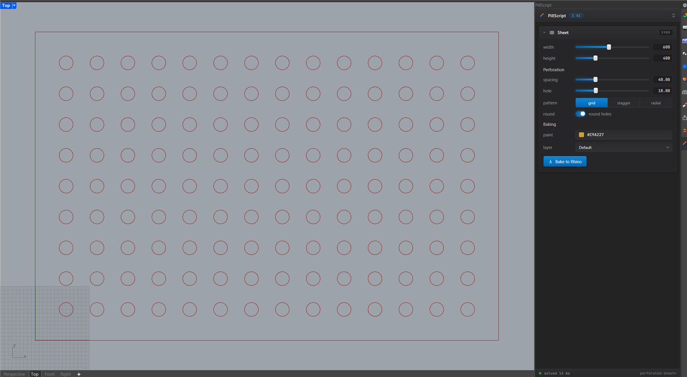
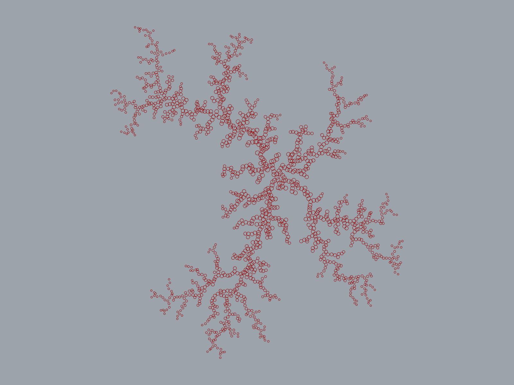

# PillScript

PillScript is a C# script component for Grasshopper in Rhino 8. What it adds over the built-in one:

- a Monaco editor with Roslyn behind it
- compilation on demand, not on every keystroke
- a script kept as a folder of files, which is also a real csproj an IDE can open
- inputs and outputs read from the `RunScript` signature
- breakpoints that stop the solve and show the locals
- controls that a script can put in a Rhino panel

The editor window is laid out and coloured after Visual Studio Code's Dark Modern: a title bar the
page draws itself, a rail of layout toggles, a sidebar of files and parameters, a toolbar, a panel
with output, problems and variables, and a status bar. Rhino owns the window, so it stays over the
canvas and hides with it instead of floating over the whole screen.

Two buttons at the foot of the rail dock the editor to the left or the right of the canvas.
Pressing the side it already sits on undocks it into a separate window. A third button below
them moves the canvas to the component the editor belongs to and selects it, taking about half a
second to travel and landing in the middle of whatever strip of canvas is still visible. The
movement is animated so that the direction stays readable.

While docked, the editor covers the canvas rectangle and leaves the ribbon and the status bar
clear. It moves and resizes with Grasshopper. The strip along the edge facing the canvas is a
splitter; the share it sets is stored as a fraction, so it survives Grasshopper being resized. The
title bar disappears while docked and a close button appears in the rail.

Docking does not shrink the canvas, it covers part of it. Making room would mean resizing
Grasshopper's own controls, which is not reliable between versions.

A component with an open editor is marked with a blue plate on the canvas. In a definition with
several script components, that is the only way to tell which window belongs to which component.

## Installing

Rhino 8.30 or newer, Windows, 64 bit. The editor runs in WebView2, which Rhino 8 installs for its
own interface, so there is nothing else to fetch.

In Rhino, run `_PackageManager`, search for PillScript, install it and restart Rhino. The download
is about 13 MB, most of it Monaco.

## Building it yourself

```
dotnet build src/PillScript/PillScript.csproj -c Release
```

Copy everything in `src/PillScript/bin/Release` into
`%APPDATA%\Grasshopper\Libraries\PillScript` and restart Rhino. The `web` folder has to travel
with the `.gha`; it holds Monaco.

The same folder is what the package is made of. `manifest.yml` and `icon.png` are copied into it by
the build, so the package is built from the build output:

```
"C:\Program Files\Rhino 8\System\Yak.exe" build --platform win
```

run inside `src/PillScript/bin/Release`. Yak reads the minimum Rhino version from the assembly's
references, which is where the 8.30 in the package name comes from: the Grasshopper package this
builds against. Referencing an older one widens the range and needs testing on the oldest Rhino
that has to run it.

## Writing a script

The component looks for exactly one public class with a public `RunScript` method. Ordinary
parameters become inputs, `out` parameters become outputs, and the CLR type decides which
Grasshopper parameter carries them.

```csharp
public class Script : ScriptBase
{
    public void RunScript(
        [Description("Corner points of the outline")] List<Point3d> points,
        [Default(2)] int divisions,
        out Polyline outline,
        out double length)
    {
        outline = PolyHelper.Close(points);
        length = outline.Length;

        Print("{0} corners", points.Count);
    }
}
```

`GlobalUsings.cs` is an ordinary file in the project and holds the namespaces every file starts
with. Adding a line there saves repeating a using in each file. It cannot be renamed or deleted,
because the build needs it.

`List<T>` gives a list input, `GH_Structure<T>` or `DataTree<T>` gives a tree, anything else is an
item. `[Description]`, `[Name]`, `[Default]` and `[Optional]` adjust the parameter. Deriving from
`ScriptBase` is optional and adds `Print`, `Remark`, `Warning`, `Error`, `Component`, `Iteration`
and `RhinoDocument`.

The parameter list is rebuilt after each successful compile. Wires survive as long as the parameter
keeps its name, its type and its access.

A `DataTree` of a plain type has each item converted on the way in. An item that will not convert
is left out, and the component reports which parameter and which branch it came from, so a tree can
be shorter inside the script than it was on the wire.

## What survives between runs

`RunScript` is called once per iteration, not once per solve. A list of three numbers into an input
declared as a single value runs the method three times, with `Iteration` counting 0, 1, 2.

The script class is turned into an object once per build, and all those calls run on that same
object. This is how the C# component Grasshopper ships behaves. A field therefore carries from one
call to the next, and a field initialiser runs once:

```csharp
public class Script : ScriptBase
{
    int calls;                              // 1, 2, 3, 4 ... across iterations and solves
    List<int> seen = new List<int>();       // built once, and it keeps growing

    public void RunScript(int n, out string state)
    {
        calls++;
        seen.Add(n);
        state = calls + " calls, " + seen.Count + " values seen";
    }
}
```

A `static` behaves the same way, since both live as long as the build does.

Two things are worth knowing before leaning on either. They belong to the component. Each component
compiles its own assembly into its own load context, so two components running identical source keep
separate counters. They are also discarded at the next compile, which throws
the old build away and unloads it. Adding or removing a breakpoint has the same effect.

State here survives solving and does not survive editing. The trap is the same one the built-in
component has: a field that collects something grows on every iteration, not every solve, and
nothing empties it until the next compile. Clear it at `Iteration == 0` to get one solve's worth.

## Controls in a Rhino panel

A script can register controls that appear in a Rhino panel, docked with Layers and Properties.
Override `RegisterUi`:

```csharp
public class Script : ScriptBase
{
    double radius;
    int sides;
    bool bake;

    public override void RegisterUi(UiRegistrar register)
    {
        register.Caption("Outline");
        register.Slider("radius", 1, 50, 12, out radius);
        register.Whole("sides", 6, out sides, label: "corners");
        register.Button("bake", out bake, label: "Bake to Rhino");
    }
}
```

Each call does two things: it describes one control for the panel, and it assigns that control's
current value to the variable passed in. `RegisterUi` runs before every solve, so `radius` holds
the panel's value by the time `RunScript` reads it, and no lookup by name is needed at the point of
use.

Publish to panel in the component's menu adds a component to the panel, and the panel opens the
first time that happens. Published components stack, each under a heading carrying four characters
of the component's id. Clicking a heading rolls the section up, and dragging one moves it among the
others. A section is named after the script's first `Caption`; renaming the component on the canvas
overrides that.

Control values are saved in the `.gh`, together with the order of the sections and which of them
are rolled up, so a definition opens with the panel as it was left. The starting values come from
the code, so changing a default in `RegisterUi` changes it for every definition that has not been
touched. The bar at the foot of the panel reports the duration of the last solve and turns its lamp
red if the script threw.

A button is true for the one solve its press caused and false on every other solve. Dragging a
slider produces one solve after the dragging stops instead of one per pixel.

The control kinds: `Slider` for a number between bounds, `Number` and `Whole` for one typed in,
`Toggle` for a switch, `Choice` for one of a list, `Text` for a line to type, `Vector` for three
numbers on a row, `Colour` for a swatch that opens Rhino's colour picker, `Layer` for a layer of
the Rhino document by full path, `Button` for something to press, and `Caption` for a word of
explanation. A `Choice` of up to three short options is drawn as a segmented control, anything
longer as a dropdown.

The panel holds a web view and nothing else, so every control is an HTML element. A script that
carries a `ui.css` restyles them: the file is appended after the default stylesheet, so its rules
win by cascade order. That styling is not scoped to the section it came from. One script's `ui.css`
restyles the whole panel, including the sections other components published.

## Component icons

Phosphor icon in the component's menu takes any name from https://phosphoricons.com: `gear-six`,
`flask`, `waves-bold`, `heart-fill`. Type it on the line in the menu and press Enter. The same
drawing is used on the canvas and at the head of the component's section in the panel. An empty
name restores the pill.

The set has some nine thousand drawings, too many to carry in a plugin, so an icon is fetched the
first time its name is used and kept under `%LOCALAPPDATA%\PillScript\icons` afterwards. On a
machine with no route to the internet the component keeps the pill and the name stays saved; the
icon appears once a fetch succeeds. Phosphor is MIT licensed and none of it is redistributed here.

## Examples

`examples/perforated-sheet.gh` is a sheet of holes with nothing on the canvas to drive it. Every
control is registered in `RegisterUi` and drawn in the panel: the two sizes, the spacing, the hole
diameter, the pattern, whether the holes are round, then a colour, a layer and a button that bakes
the result into Rhino. One component, one file, no sliders.



Pressing Bake to Rhino twice bakes two copies, since the button is true for exactly the solve its
press caused. Dragging a slider afterwards bakes nothing.

`examples/diffusion-limited-aggregation.gh` grows a dendrite. Particles are sent in one at a time
from a circle outside the cluster, and each freezes where it first comes within reach of something
already stuck. The branching is not designed anywhere in the code: an arm reaching outwards is hit
before the bay behind it gets the chance, and that alone produces the shape.



Four sliders feed the component, and the circles it produces are drawn by a single Circle CNR. The
script is in two files, which is the point of showing it: `Script.cs` does the walk, and
`Aggregate.cs` holds the cluster behind a grid so that a walker only compares itself against the
particles near it. Without that grid the run is quadratic and 1500 particles take minutes. With it,
the default settings stick 1500 particles in about a fifth of a second, after five million steps of
walking.

Double-click the component to read it.

## What the editor knows

Completion, hover, parameter hints and squiggles come from Roslyn, running in the Rhino process
against the same assemblies the component compiles with. Typing a dot after `Mesh` lists the
members RhinoCommon actually has, and a misspelled member is underlined before anything is built.

Errors shown while typing come from the semantic model and describe the code on screen. The
Problems panel is the record of the last compile. Both are kept because they answer different
questions.

F12 goes to a declaration, Shift-F12 lists every use, and F2 renames across every file in the
script at once. These work on the script's own files. A type from RhinoCommon is declared in an
assembly, and there is no file to open for it.

## Breakpoints

Click the gutter, or press F9, to mark a line. The marks are compiled into the script: Roslyn
rewrites the tree and puts a call in front of each marked statement, carrying the locals that are
definitely assigned at that point. When the solve reaches one it stops and the editor shows the
values. Rhino stays responsive because the wait runs a nested message loop instead of blocking
the thread.
Continue lets the script finish, Stop abandons that solve.

The pauses are part of the build, so moving a breakpoint makes the component stale. The breakpoint
count in the status bar opens a small menu: disable every mark at once, which leaves them in place
but builds a script that runs straight through, or remove them.

## Compiling

Nothing compiles during a solution. Press Compile in the editor, F5, or use the component's right
click menu. Between an edit and the next compile the component is outlined in blue and keeps
running the previous build, so a half-written script does not break a definition that was working.

A component compiles once when the document opens, which restores a saved definition to a running
state, and this can be turned off per component.

## The project on disk

Each component owns a folder under `%LOCALAPPDATA%\PillScript\projects`, holding a normal SDK style
project. Open that folder in Visual Studio, Rider or VS Code for completion against the running
Rhino: `Directory.Build.targets` is regenerated on every mirror with this machine's paths, and
`GlobalUsings.g.cs` carries the same usings the component compiles with. Edits made outside are
picked up by a watcher, and the component goes stale as if they had been typed in the editor.

The source text is stored in the `.gh` file, so sending someone a definition sends the code with
it. The folder is a working copy: one that nothing has compiled from in seven days is deleted when
Grasshopper next loads, and reopening that definition writes it back. What is lost is the restore
sitting in it, which the next compile does again.

`PackageReference` entries in `Script.csproj` are restored with the .NET SDK on the next compile
and used by both the component and the IDE. `Reference` entries with a `HintPath` work too, for a
DLL that is not on NuGet. Packages are the only part that needs the SDK installed.

References are managed from the sidebar. The References line opens a window listing the assemblies
the project points at by path and the NuGet packages it asks for, with a file picker for the first
and a name and version for the second. Both are written into `Script.csproj`, so the same edits can
be made by hand or in an IDE, and the same list is available over the bridge.

A `ProjectReference` to a csproj alongside the script is built with the SDK on compile and its
output referenced, so a library can be kept in its own project and edited in an IDE.

## Driving it from outside

With `PILLSCRIPT_BRIDGE=on` in the environment Rhino starts from, the plugin listens on
http://127.0.0.1:57321. `tools/mcp.js` wraps that as an MCP server, so an agent can work on a
component's project directly: list the components on the open canvases, read, write, rename and
delete files, compile and read the diagnostics, solve and read what the script printed. It is the
same project the editor window shows, so a file written this way appears in the editor immediately
and the component goes stale until it is compiled. `PILLSCRIPT_BRIDGE_PORT` moves the port.

Register it with:

```
claude mcp add pillscript -- node <repo>/tools/mcp.js
```

Nothing listens unless the variable is set. The editor needs no port at all, since it talks to the
plugin inside the process, so installing the package gets the editor and nothing else. Turning the
bridge on is worth understanding first, because writing a file and compiling it means running code.

Binding to the loopback address keeps other machines out. It does nothing about the browser on this
one: a page can reach 127.0.0.1, and it does not need to read the answer for a written and compiled
script to have run. A request is therefore answered only when it declares `application/json`,
carries no `Origin` header, and names the loopback address in `Host`. A web page cannot control the
first two headers, and the third catches a rebound DNS name. There is no authentication beyond
that, which is the same posture as a debug server: anything already running code on the machine can
do more than this allows.

## How the code is laid out

The code is in three layers, and no file runs over about three hundred lines.

`src/PillScript/Scripting` is the model and knows nothing about windows. A `ScriptProject` holds
the files and mirrors them to a folder; `ScriptProject.Disk.cs` is that mirror and
`ProjectTemplates` is what a new script starts as. `PackageResolver` turns what the csproj
references into assembly paths, with `DotnetSdk` running the SDK and `RestoreAssets` reading what
restore left behind. `ScriptCompiler`, `ScriptSignature`, `ScriptRunner` and `ScriptLoadContext`
build and run the script. `ScriptLanguageService` answers the editor between builds and formats its
answers through `LanguageFormats`.

`src/PillScript/Editor` is the view and the view model. `EditorViewModel` is everything the editor
can do to a component, written without a single UI type. `EditorBridge` carries messages and
decides which half each belongs to, `EditorPayloads` holds the wire format and `EditorRequest`
parses what arrives. `ScriptEditorWindow` is left with what only a window can do, leaning on
`WindowFrame` for moving and resizing, `DockHost` for living inside Grasshopper and
`CanvasNavigator` for driving the canvas.

The page under `Editor/web` is plain modules with no build step. `app/state.js` holds what they
share, `app/bridge.js` is the only thing that talks to WebView2, and the rest take a part of the
window each. `index.html` lists them in load order. The stylesheet is split the same way under
`css/`.

`src/PillScript/Components` is the Grasshopper surface and `src/PillScript/Bridge` is the loopback
endpoint an agent reaches. `src/PillScript/Icons` fetches and draws the Phosphor icons.

`src/PillScript/Panel` is the Rhino panel. `UiPanelHost` is an Eto panel holding a web view and
little else, because Rhino 8 accepts a Windows Forms control here and then never builds it.
`UiPublication` gathers what the published components declare into the payload the page draws.
`UiRegistrar`, over in `Scripting`, is the class a script registers through. The page itself is in
`Editor/web/panel`, separate from the editor's and much smaller.

## Licence

The licence is MIT, in `LICENSE` at the root.

The `src/PillScript/Editor/web/vs` folder is the Monaco Editor 0.56.0, redistributed unchanged
under its own MIT licence, with the notice kept alongside it in that folder. JetBrains Mono, in
`Editor/web/panel/fonts`, is redistributed under the SIL Open Font Licence kept beside it. Rhino,
Grasshopper and Roslyn arrive as NuGet packages and are not redistributed here.

## Known gaps

- There is no terminal. One was built and then removed: as a process with redirected streams it
  could not do what a terminal tab promises, and the rest of the window already covered what it was
  for. Open project folder gives a real shell in one step. The code is in the history in case a
  pseudo console ever cooperates.
- A breakpoint pauses the whole Grasshopper solve while the canvas stays live. Editing the document
  while a script is paused has not been thought through.
- The first completion in a session waits a second or two for Roslyn to build its view of the
  project. After that it is quick.
- Completion inserts the item's display text. Roslyn's own insertion rules, which matter for
  override and partial method completion, are not applied.
- Rename is the only refactoring wired up. The workspace would answer for the rest, and they are
  not offered.
- The editor page can be opened in a browser for work on the UI itself. `index.html` shows a
  sample, and `index.html?probe=1` stands in a fake component so that the Monaco wiring can be
  exercised without Rhino.
